How I was introduced to market structure is that I was taught that price moves in a series of HHs and HLs or LLs, here is a schematic of price making HHs and HLs (bullish market structure):

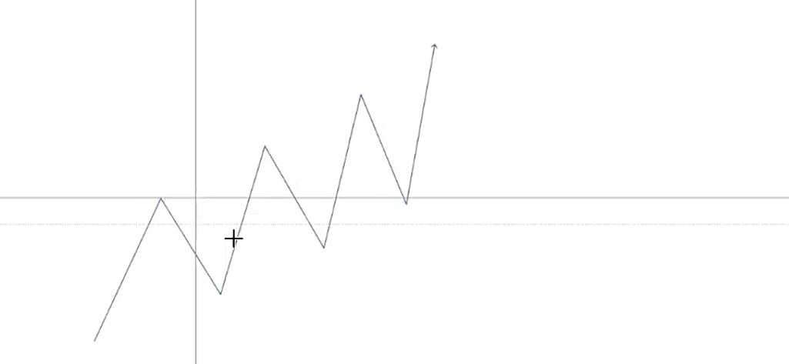

We have more advanced market structure that includes liquidity zones, here is a schematic of price that has liquidity zones (lows that are being swept):

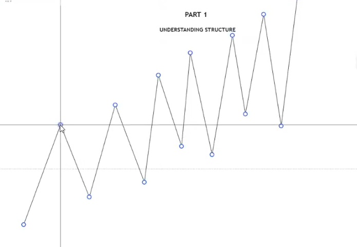

This is how structure moves in a real market condition, price makes a BOS and retaces back into the POI and then price breaks the high/low and then price breaks structure again, price then engineers liquidity and comes back to sweep that low/high and taps into the POI price then expands breaking the trading range:

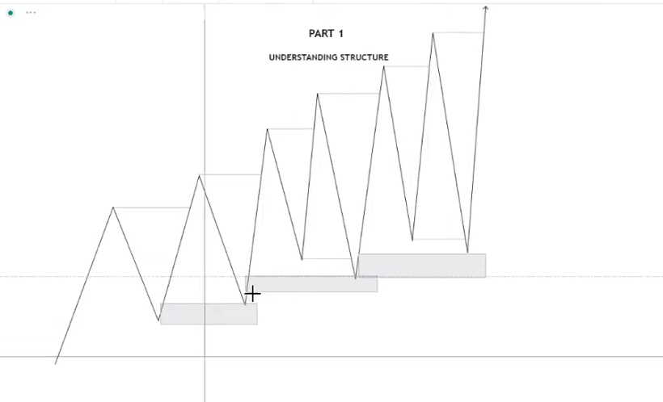

This is how price moves, you're not simply going to have price make HHs and HLs or LLs and LHs, price will raid lows and highs because it needs more fuel in order to expand price. 

Here is typical market structure from bullish to bearish delivery:

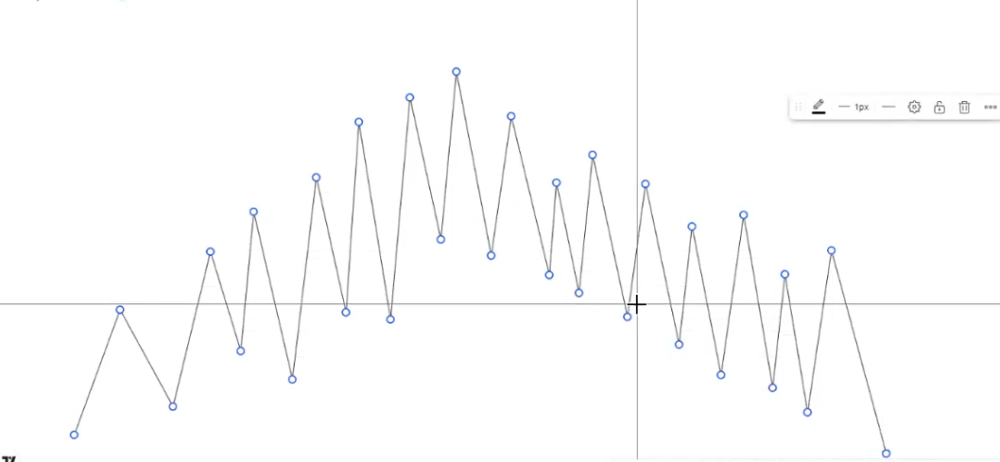

I can see price breaking below the last low after having been bullish and that is an indication that the price is shifting from bullish to bearish and after having broken below the last low of the bullish market cycle, price retraced back into a supply zone (POI) before discounting further:

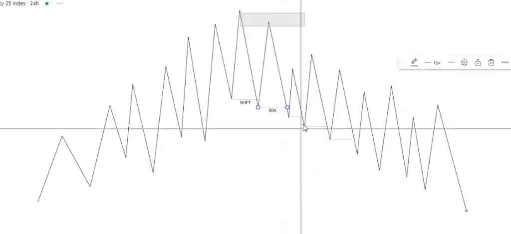

Seeing that price has shifted and then tapped into the bearish POI, it means we should now only be looking for selling opportunities because price has shifted bearish. Only when price shifts again should we be looking for buying opportunities. I'm not supposed to trade agains the order flow but inline with the order flow of the market.

When I trade against the order flow of the market I get turned into liquidity because that's not where the market flow is so its best to trade inline with the flow of the market instead of against it:

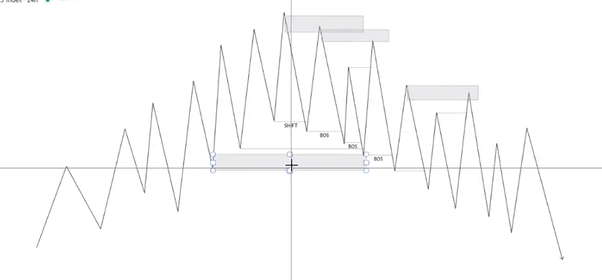

Here is a chart example of price shifting from bearish to bullish, price retraces back into a demand zone (POI) in the shift before breaking out of the range again creating a BOS, this is a good indication that I shouldn't be looking for selling opportunities:

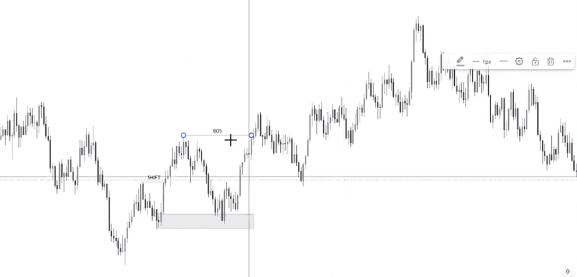

I shouldn't make the mistake of trying to sell or buy when price has clearly shifted because price will make it seem as if it is going in the direction just to take me out:

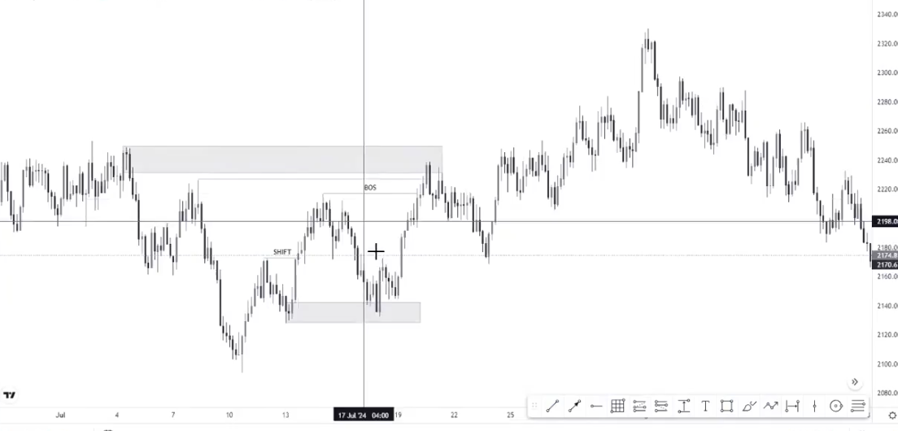

After price has been bulish, it shifted into bearish by breaking the low and failing to break above the last high and failing to break above the shift (which is more confirmation):

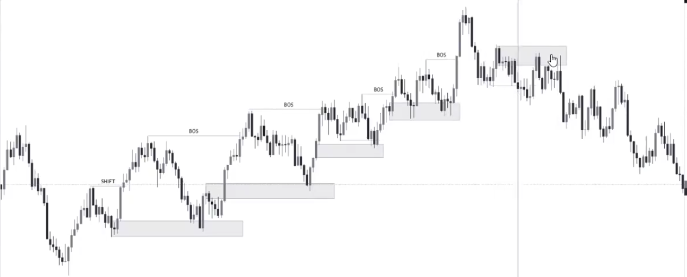

Here's a bullish to bearish market structure with liquidity raids and retracements to POIs:

 

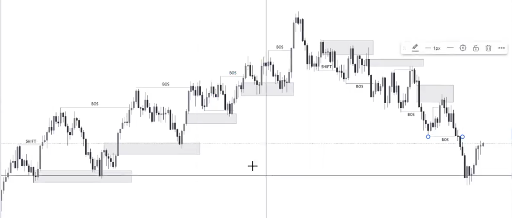

Don't fall into the trap of buying when the marked structure has broken because its a trap:

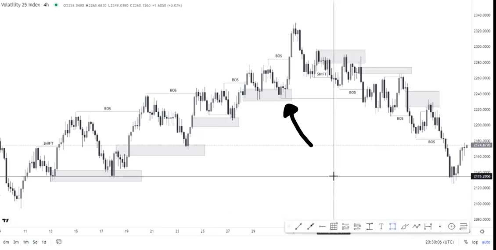

When you are in the wrong direction of the order flow, your setups will keep getting violated, check how man order blocks keeps getting violated:

 

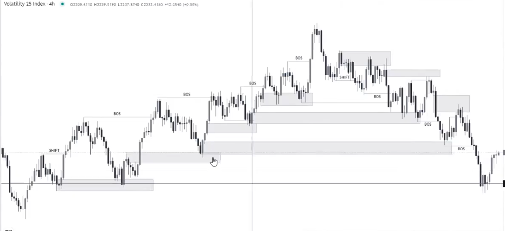

PD Arrays will only work in line with order flow and not against it. 

Don't trade against the order flow, trade inline with it. 

Now its time for case studies!

 

