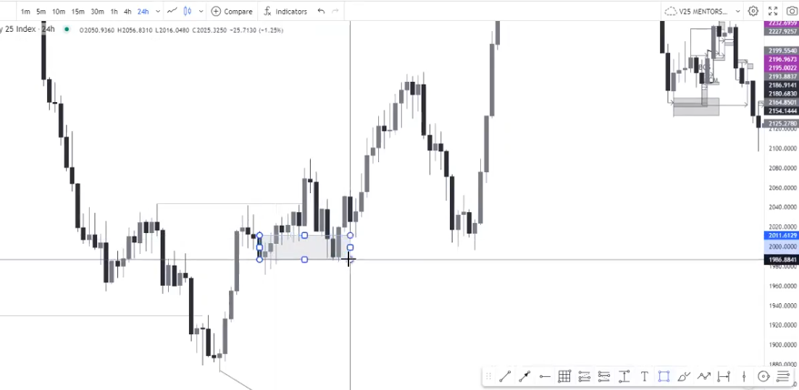

These are called PD arrays:

Premium means expensive and Discount means cheap.

When price is in a Premium zone, you should be looking for sells and when price is in a Discount zone you should be looking for buys in a trading range.

These are not the complete list of PD arrays, however these are the PD arrays that most commonly works with synthetic indices: 

* Premium zone:
  * Old highs
  * Rejections
  * Order Blocks
  * Fair Value Gaps
  * Breaker Blocks

* Discount zone:
  * Old lows
  * Rejections
  * Order Blocks
  * Fair Value Gaps
  * Breaker Blocks

I have to trade these inline with how they are being displayed:

Example of moving from a buy to sell profile:

* The first PD array is the Old High.
* The second PD array is the Rejection into the old high (sweep), price normally moves away quickly.
* The third PD array is the order block in the rejection price leg after price has created a ChoCH.
* Also look out for Fair Value Gaps near the Order Block (fourth PD array).
* The fifth PD array is Breaker Blocks also called Mitigation Blocks which is normally located at the shift of the price leg.

Breaker Blocks normally occur on currencies where price will simply tap into the Breaker Block and then discount:

On Synthethics however price will not respect it most of the time:

Use the PD arrays on the higher timeframes to know where the market currently is, in order to know whether price is in Premium or Discount, use the PD arrays to establish trend changes that gives us an indication of whether price is in a Discount or Premium array:

Since we know that the high sponsored the move to the Discount array, we can use it as a target for the buys (Draw On Liquidity):

This is what it means to trading in a dealing range (from PD array to PD array or range high to range low):

To a large extend you might see price creating a new Premium array after the DOL and that usually happens when price is in a ranging market on the Daily and Monthly timeframe but if you don't see that price might keep on buying and buying. 

Liquidity is usually the start of a price movement.

Areas of liquidity are very important, they are normally resting at old highs and old lows of an array.

Price gets rejected after the Old Low was taken:

After the rejection we have the ChoCH which is an indication that the trend is changing:

After the ChoCH we have a retest:

We have an Order Block and Fair Value gap in the Rejection price leg:

The reason why I must factor in the Fair Value Gaps that are near the Order Blocks is because price will always fill in the Fair Value Gaps and the Order Blocks acts as support:

A Fair Value Gap prior to an Order Block is a high probability setup. 

There are some cases where an Order Block doesn't have a Fair Value Gap, that setup is also legit especially when it is inline with the other PD arrays that are listed.

We also have a Breaker Block (Mitigation Block) on the chart, a Breaker Block is an failed Order Block as price tried to sell off but failed to do so and instead broke above the Order Block:

A Breaker Block is usually associated with a Markets Structure Shift but I must mostly pay attention to liquidity as that is the driving force of price.

This is what the discounted PD arrays would look like when all the conditions are met:

* Old low
* Sweep of old low (Rejection)
* Order Block
* Fair Value Gap
* Breaker Block
* Market Structure Shift
* Continuation of Bullish Market Structure

Continuation of Bullish trend with retest of Order Block:

This high was responsible for the bearish move to the downside so it means that the high is the Draw On Liquidity (DOL) which is where the take profits are:

Always use your higher time frames to find the PD Arrays because they tend to hold and to show you where the swing positions are.

Here we can see how price never came back to tap into the Order Block and only took out the low of the bullish structure and tapped into the Fair Value Gap. Price engineered liquidity to go higher:

 

Price is still in the bullish profile which means that price is going to break above all these highs in order to tap into the DOL.

Once I'm able to put everything together at this extend, seeing that I'm trading the current market structure I can ask myself am I trading the corrective move or the impulsive move (seeing that we are currently bullish).

Here price took out a low and created a market structure, this can be used to establish PD arrays on the H4 chart:

The high of that range is the Premium and where the low was taken is the Discount zone:

On the H1 chart we can see the market structure more clearly, we have the Daily old low being taken plus a rejection. On the H1 chart we can see price creating a market structure shift indicating that price is going higher:

Don't forget to forward and backtest what you have learned!
