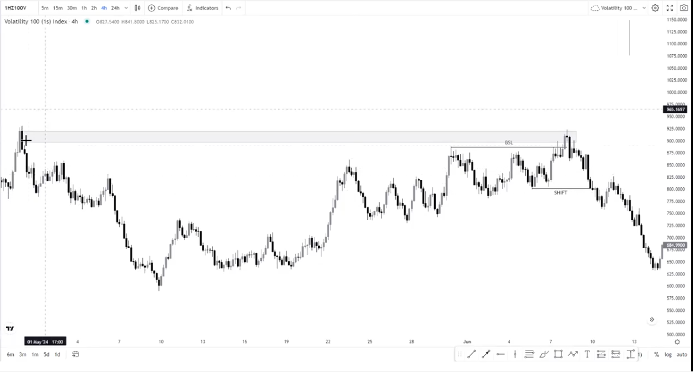

Liquidity is the originator of a price movement, take a look at your HTF Highs and Lows and ask yourself how that move came about.

If you want to start a trend, liquidity is what you should be looking out for.

We're dealing with three types of liquidity:

* Buyside Liquidity
* Sellside Liquidity
* Inducements

There are other types of liquidity but these are the main ones we're focusing on.

What is Buyside Liquidity?

* It is liquidity that is resting above highs
* It can also be called a stop run or a raid of a high.

What is Sellside Liquidity?

* It is liquidity that is resting below lows.
* It can also be called a stop run or a raid of a low.

Let's say you have your PD array and you're bullish. Let's say price decides to raid the high and started selling to the downside:

To a very large extend before you have the move to the downside, the liquidity (which is the high being raided) is the move that started the whole sell off:

Once liquidity has been cleared and we have a market structure shift, it now means that the trend is changing:

Always remember that its liquidity first and then structure, because liquidity is the originator of a price movement.

Liquidity can also be presented in a different way, here's an example of price retesting the originator which is old market structure before making a series of lower highs and lower lows (BOS):

What are inducements?

* Inducements are used to induce early buyers and sellers into getting into a position just for them to get stopped out before the real move. Especially when price is at a supply zone.

Here is another way people can be induced into entering their position early whereby we have structure on the left side of the chart and the price didn't tap into it but hovered just below it just for price to come back and take out the high that hovered below the supply zone and actually tap into the supply zone:

Everything that happens in the market is all liquidity, price will have to take out a old high/low first before moving to a specific direction.

Here's a chart example of BSL with a market structure shift:

If your POI on the left side of the chart is a good place to sell from, the BSL becomes engineered liquidity:

 

You normally find inducements close to the POI.

Here's another chart example of BSL with a market structure shift:

If used properly, inducements can be used as BSL as well:

Sometimes you might not always see a POI to the left, that doesn't mean that you shouldn't look for it. Price moves from liquidity to liquidity.

Always remember that the market structure that you trade should be visible, if its not visible do not trade it, you have to be very sure of what you're looking at.

Here is an example of SSL with a shift, we also have inducement before price taps into the POI: 

Let's say that the previous market structure wasn't there, this would also have been SSL:

For continuations of market structure, the following can also work:

 

Chart example of price taking BSL, tapping to POI and continuing:

 

Price uses liquidity to deliver itself precisely.

Remember to K.I.S.S.

