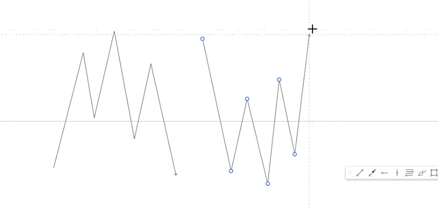
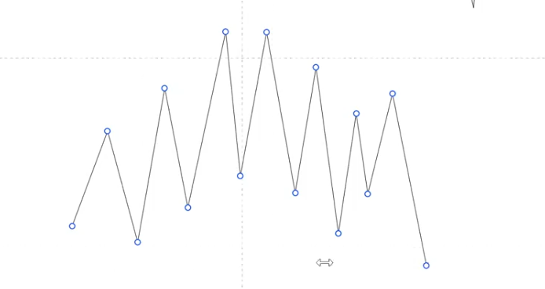
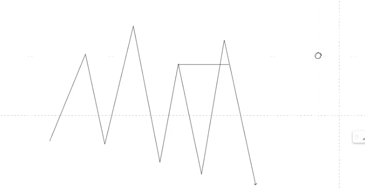
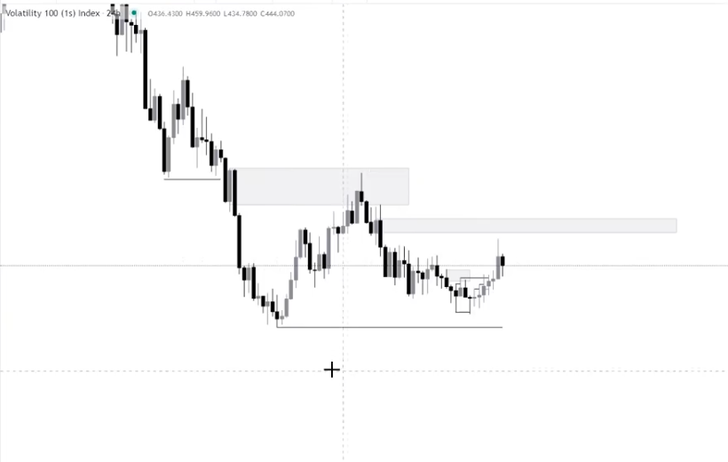
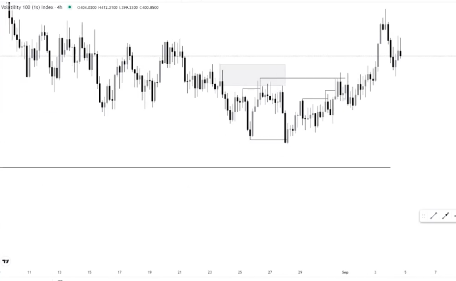
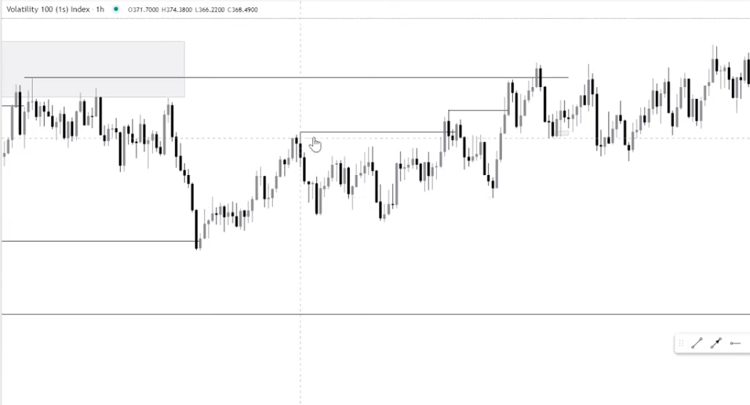
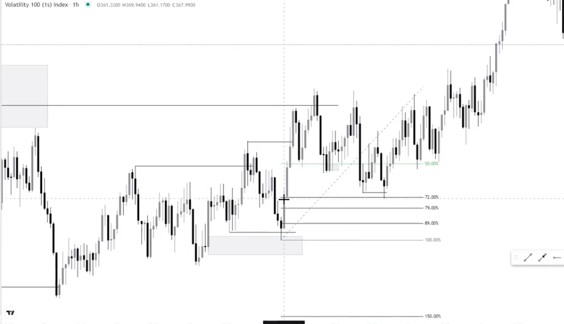

Why do we need to consider the HTF as an entry point ,why do we also need to consider the LTF as an entry point?

* Both of them have their advantages and disadvantages.

The HTF entries are the entries that you make on the H4 and H1 chart. The advantages are:

* You'll be able to swing trade as they are used mostly for swing trading.
* You'll be able to catch more pips.

The Disadvantage of HTF are:

* Your SL tends to be wide.
* You might have to sit through a lot of drawdown before you see profits.

The advantages of the LTF are:

* You're able to refine your entries which means less risk.
* To maximize your lot sizing.

The disadvantages of the LTF are:

* You might get stopped out multiple times.
* You might have false entry points.

These are the PD arrays that we'll be using:

Before there is an expansion in price, there has to be an accumulation.

* Accumulation
* Manipulation
* Distribution

This is what an accumulation would normally look like on the HTF and LTF:

Price has to accumulate first before it moves either to the upside or to the downside.

Price will sometimes take out extra inducements before moving in its intended direction:

Keep in mind that its not a pattern but rather the narrative of price. 

Chart example:

* On the daily timeframe we have the following bearish order flow and failed to break below the low.

* On the H4 timeframe we still have bearish order flow.
* Price sold to the downside from the last bearish POI raiding that low.

* Price then started creating bullish structure on the H1 chart after the raid.

PD arrays work when you are inline with the price narrative:

If you want to be a good synthetic trader you have to be versatile with the HTF and LTF entries.

Don't just blindly trade the LTF as you will get stopped out multiple times.
